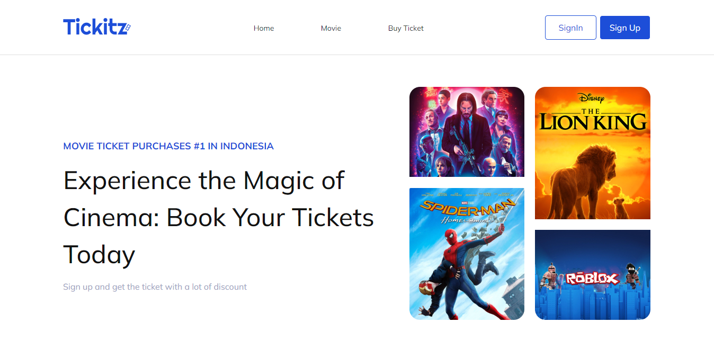

<h1 align="center">
  Slicing Aplikasi Tiket Dengan HTML, CSS and Responsive Web
</h1>

<p align="center"></p>

## 💻 Built with

* Html5 Semantic
* Grid/Flexbox
* External CSS
* Media Query

## 🛠️ Installation Steps

* Clone the repository

```bash
git clone https://github.com/taufikharahap/front-end-html-css-responsive-web-tickitz.git
```

You are all set!
🌟 

<p align="center">
Developed with ❤️ in Indonesia 	🇮🇩
</p>
